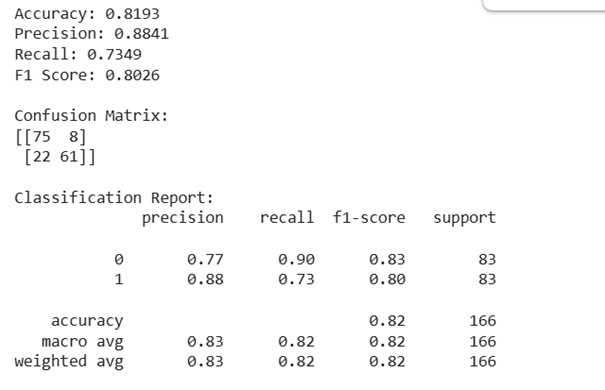
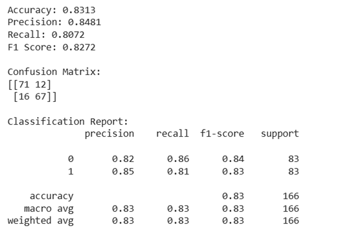
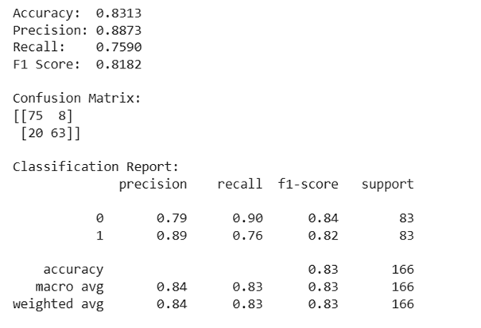

CANNABİS KULLANIM TAHMİNİ

Giriş
Bu proje, bir kişinin kişilik özellikleri kullanılarak cannabis kullanıcısı olup olmadığını tahmin etmeyi amaçlamaktadır. Veri seti UCI Machine Learning Repository'den alınmıştır. 1885 katılımcının NEO-FFI-R, BIS-11 ve ImpSS gibi kişilik testlerinden elde edilen ölçümleri ile 18 farklı madde için kullanım sıklığı bilgilerini içermektedir. Hedef değişken olarak “Cannabis” seçilmiştir. Orijinal veri setinde kullanım sıklığı CL0'dan CL6'ya kadar 7 farklı sınıfta tanımlanmıştı. Biz bunu basitleştirerek "hiç kullanmamış" ve "en az bir kez kullanmış" şeklinde iki sınıfa indirgedim. Ancak bu dönüşümün ardından ciddi bir sınıf dengesizliği ortaya çıktı — 1472 kullanıcıya karşılık yalnızca 413 kullanmayan. Bu dengesizliği gidermek için çoğunluk sınıfından rastgele örnekler atarak (downsampling) her iki grubu 413'e eşitledim. Sonuçta 826 örnekten oluşan dengeli bir veri setiyle çalıştım.

Veri Seti
•	Kaynak: UCI Machine Learning Repository – Drug Consumption (Quantified)
•	Özellikler: Age, Gender, Education, Country, Ethnicity, Nscore, Escore, Oscore, Ascore, Cscore, Impulsive, SS (12 sayısal özellik)
•	Hedef: Cannabis (0: kullanmıyor, 1: kullanıyor)
•	Toplam örnek: 826 (413 sınıf 0, 413 sınıf 1)

Modeller
Üç farklı modelde n_h = 3, n_steps = 500 hiperparametreleri ile geliştirdim ve aynı eğitim-test seti üzerinde karşılaştırdım.

Model 1 – NumPy MLP (1 Gizli Katman) Derste işlenen temel model. Herhangi bir kütüphane kullanmadan sıfırdan NumPy ile yazıldı. Forward propagation, backpropagation ve parametre güncellemesi elle implement edildi.
•	Mimari: 12 özellik → 3 nöron→ 1 çıkış katmanı
•	Aktivasyon: tanh (gizli), sigmoid (çıkış)
•	Kayıp: Binary Cross Entropy
•	Optimizer: SGD, learning_rate=0.01
Sonuçlar:

 
Model 2 – NumPy MLP (2 Gizli Katman) Model 1'e ikinci bir gizli katman eklenerek oluşturuldu. Aynı NumPy implementasyonu korundu, yalnızca mimari genişletildi.
•	Mimari: 12 → 6 → 6 → 1
•	Aktivasyon: tanh (gizli katmanlar), sigmoid (çıkış)
•	Kayıp: Binary Cross Entropy
•	Optimizer: SGD, learning_rate=0.01
Sonuçlar:

 
Model 3 – Scikit-learn MLPClassifier Model 1 ile aynı mimari ve hiperparametreler sklearn kullanılarak tekrar yazıldı. Amaç, sıfırdan yazdığımız implementasyonun doğruluğunu doğrulamaktı.
•	hidden_layer_sizes: (3,), activation: tanh, solver: sgd
•	learning_rate_init: 0.01, max_iter: 500, random_state: 42
Sonuçlar:

 

Discussion
Gelecek çalışmalarda downsampling yerine SMOTE gibi sentetik veri üretme yöntemleri denenebilir. Bunun yanında L2 regularizasyon ve batch normalizasyon eklenerek modelin genelleme kapasitesi artırılabilir. Farklı kişilik özellikleri ile farklı madde bağımlılıkları arasındaki ilişki de araştırılmaya değer bir alan olarak öne çıkmaktadır.

